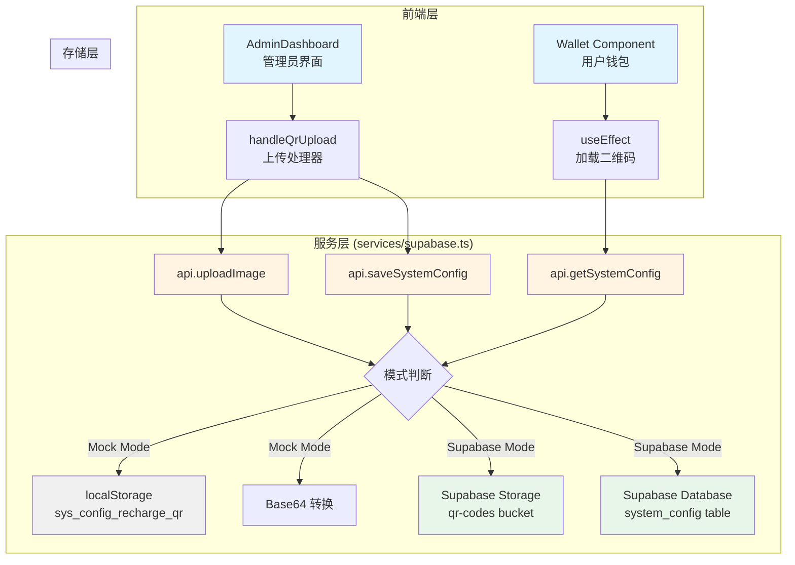

# 设计文档：管理员充值收款码配置

## 概述

本功能完善系统的充值流程，允许管理员在后台上传和配置充值收款二维码，用户在充值时能够看到管理员配置的收款码。系统采用双模式架构：Mock 模式用于开发测试（使用 localStorage 和 Base64），Supabase 模式用于生产环境（使用 Supabase Storage 和数据库）。

### 技术栈
- React + TypeScript
- Supabase (Storage + Database)
- localStorage (Mock 模式)

### 核心流程
1. 管理员在后台财务标签页上传二维码图片
2. 图片上传到 Supabase Storage（或转换为 Base64 在 Mock 模式）
3. 图片 URL 保存到 system_config 表（或 localStorage）
4. 用户充值时从配置中加载二维码 URL 并显示
5. 如果配置不存在或加载失败，显示默认占位图

## 架构

### 系统架构图



### 数据流

**上传流程：**
```
管理员选择文件 
  → handleQrUpload 验证文件
  → api.uploadImage(file)
    → [Mock] 转换为 Base64 data URL
    → [Supabase] 上传到 Storage，返回公开 URL
  → api.saveSystemConfig('recharge_qr', url)
    → [Mock] localStorage.setItem('sys_config_recharge_qr', url)
    → [Supabase] UPSERT 到 system_config 表
  → 更新 UI 状态，显示成功提示
```

**加载流程：**
```
用户打开钱包页面
  → useEffect 触发
  → api.getSystemConfig('recharge_qr')
    → [Mock] localStorage.getItem('sys_config_recharge_qr')
    → [Supabase] SELECT from system_config WHERE key='recharge_qr'
  → 设置 rechargeQr 状态
  → 渲染 
  → onError 回退到 FALLBACK_QR
```

## 组件和接口

### 1. AdminDashboard 组件

**职责：** 提供管理员上传二维码的界面和逻辑

**现有状态：**
```typescript
const [rechargeQrUrl, setRechargeQrUrl] = useState('');
const [isUploadingQr, setIsUploadingQr] = useState(false);
const fileInputRef = useRef<HTMLInputElement>(null);
```

**现有方法：**
```typescript
const handleQrUpload = async (e: React.ChangeEvent<HTMLInputElement>) => {
    const file = e.target.files?.[0];
    if (!file) return;
    
    setIsUploadingQr(true);
    try {
        const url = await api.uploadImage(file);
        setRechargeQrUrl(url);
        await api.saveSystemConfig('recharge_qr', url);
        onShowToast('充值二维码更新成功');
    } catch (error: any) {
        console.error(error);
        if (error.message?.includes('violates row-level security')) {
            alert('【上传失败】Supabase 权限不足...');
        } else {
            alert(`上传失败: ${error.message}`);
        }
    } finally {
        setIsUploadingQr(false);
    }
};
```

**需要完善的功能：**
- 文件格式验证（在上传前检查）
- 文件大小验证（限制 5MB）
- 上传进度显示
- 二维码预览功能
- 初始加载时从配置中读取现有二维码

### 2. Wallet 组件 (ProfileSubviews.tsx)

**职责：** 在用户充值时显示管理员配置的二维码

**现有状态：**
```typescript
const [rechargeQr, setRechargeQr] = useState('');
const FALLBACK_QR = 'https://dummyimage.com/300x300/eee/aaa&text=QR+Code';
```

**现有加载逻辑：**
```typescript
useEffect(() => {
    const loadQr = async () => {
        const url = await api.getSystemConfig('recharge_qr');
        if (url) setRechargeQr(url);
    };
    loadQr();
}, []);
```

**现有渲染逻辑：**
```typescript
 {
        e.currentTarget.src = FALLBACK_QR;
        e.currentTarget.onerror = null;
    }}
/>
```

**需要完善的功能：**
- 加载状态指示器（骨架屏或 spinner）
- 错误处理和用户提示
- 二维码点击放大功能
- 缓存机制避免重复加载

### 3. API 服务层 (services/supabase.ts)

**现有接口：**

```typescript
interface API {
    uploadImage(file: File): Promise<string>;
    saveSystemConfig(key: string, value: string): Promise<void>;
    getSystemConfig(key: string): Promise<string | null>;
}
```

**uploadImage 实现：**
- Mock 模式：使用 FileReader 转换为 Base64 data URL
- Supabase 模式：上传到 'pic' bucket，返回公开 URL

**saveSystemConfig 实现：**
- Mock 模式：localStorage.setItem(`sys_config_${key}`, JSON.stringify(value))
- Supabase 模式：UPSERT 到 sys_config 表

**getSystemConfig 实现：**
- Mock 模式：localStorage.getItem(`sys_config_${key}`)，去除引号
- Supabase 模式：SELECT value from sys_config WHERE key=?，去除引号

**需要完善的功能：**
- 文件类型和大小验证
- 更好的错误处理和错误消息
- 上传进度回调（可选）
- 图片 URL 验证

## 数据模型

### Supabase 数据库表

#### system_config 表

```sql
CREATE TABLE IF NOT EXISTS system_config (
    id UUID PRIMARY KEY DEFAULT gen_random_uuid(),
    key TEXT UNIQUE NOT NULL,
    value JSONB,
    created_at TIMESTAMP WITH TIME ZONE DEFAULT NOW(),
    updated_at TIMESTAMP WITH TIME ZONE DEFAULT NOW()
);

-- 创建索引
CREATE UNIQUE INDEX IF NOT EXISTS idx_system_config_key ON system_config(key);

-- 创建触发器自动更新 updated_at
CREATE OR REPLACE FUNCTION update_updated_at_column()
RETURNS TRIGGER AS $$
BEGIN
    NEW.updated_at = NOW();
    RETURN NEW;
END;
$$ LANGUAGE plpgsql;

CREATE TRIGGER update_system_config_updated_at
    BEFORE UPDATE ON system_config
    FOR EACH ROW
    EXECUTE FUNCTION update_updated_at_column();
```

**字段说明：**
- `id`: UUID 主键
- `key`: 配置项键名（唯一），如 'recharge_qr'
- `value`: JSONB 类型，存储配置值（字符串会被 JSON.stringify）
- `created_at`: 创建时间
- `updated_at`: 更新时间（自动触发器）

**示例数据：**
```json
{
    "id": "550e8400-e29b-41d4-a716-446655440000",
    "key": "recharge_qr",
    "value": "\"https://ksstnzetvktwcoeyheqv.supabase.co/storage/v1/object/public/qr-codes/recharge_qr_1234567890.png\"",
    "created_at": "2024-01-15T10:30:00Z",
    "updated_at": "2024-01-15T10:30:00Z"
}
```

### Supabase Storage

#### qr-codes 存储桶

**配置：**
- 名称：`qr-codes`
- 访问权限：Public（公开读取）
- 文件大小限制：5MB
- 允许的文件类型：image/*

**存储策略（Policies）：**

```sql
-- 允许认证用户上传（管理员）
CREATE POLICY "Allow authenticated uploads"
ON storage.objects FOR INSERT
TO authenticated
WITH CHECK (bucket_id = 'qr-codes');

-- 允许公开读取
CREATE POLICY "Allow public downloads"
ON storage.objects FOR SELECT
TO public
USING (bucket_id = 'qr-codes');

-- 允许认证用户删除自己上传的文件
CREATE POLICY "Allow authenticated deletes"
ON storage.objects FOR DELETE
TO authenticated
USING (bucket_id = 'qr-codes');
```

**文件命名规则：**
```
recharge_qr_{timestamp}.{extension}
例如：recharge_qr_1705315800000.png
```

**公开 URL 格式：**
```
https://ksstnzetvktwcoeyheqv.supabase.co/storage/v1/object/public/qr-codes/{filename}
```

### Mock 模式存储

#### localStorage 键值对

```typescript
// 配置存储
localStorage.setItem('sys_config_recharge_qr', '"data:image/png;base64,iVBORw0KG..."');

// 读取时去除引号
const value = localStorage.getItem('sys_config_recharge_qr')?.replace(/^"|"$/g, '');
```

**数据格式：**
- 键：`sys_config_recharge_qr`
- 值：JSON 字符串包裹的 Base64 data URL
- 示例：`"data:image/png;base64,iVBORw0KGgoAAAANSUhEUgAA..."`

## 正确性属性

*属性是一种特征或行为，应该在系统的所有有效执行中保持为真——本质上是关于系统应该做什么的正式陈述。属性作为人类可读规范和机器可验证正确性保证之间的桥梁。*


### 属性 1：配置往返一致性

*对于任何*有效的二维码 URL，当保存到系统配置（key='recharge_qr'）后再读取，应该返回相同的 URL 值，无论是在 Mock 模式还是 Supabase 模式下。

**验证：需求 1.3, 3.4, 4.4, 5.2**

### 属性 2：文件格式验证

*对于任何*上传的文件，系统应该验证其 MIME 类型是否为有效的图片格式（image/jpeg, image/png, image/gif, image/webp），并且只接受这些格式的文件。

**验证：需求 1.1, 7.3, 7.5**

### 属性 3：文件大小限制

*对于任何*上传的文件，如果文件大小超过 5MB，系统应该拒绝上传并显示错误提示；如果文件大小在限制内，应该允许上传。

**验证：需求 7.1, 7.2**

### 属性 4：图片上传返回有效 URL

*对于任何*成功上传的图片文件，系统应该返回一个有效的 URL，该 URL 在 Mock 模式下应该是 Base64 data URL（以 "data:image/" 开头），在 Supabase 模式下应该是公开可访问的 URL（包含 Supabase 域名）。

**验证：需求 1.2, 3.2, 4.2**

### 属性 5：配置覆盖行为

*对于任何*已存在的配置项（key='recharge_qr'），当保存新的值时，新值应该完全覆盖旧值，而不是追加或合并。

**验证：需求 5.1**

### 属性 6：未配置状态处理

*对于任何*配置查询，当配置值为 null、undefined 或空字符串时，系统应该将其视为未配置状态，并在 UI 中显示默认占位图。

**验证：需求 2.3, 5.3**

### 属性 7：错误时显示默认图

*对于任何*无效或无法访问的二维码 URL（包括加载失败、URL 格式错误、网络错误），Wallet 组件应该显示默认占位图而不是错误页面或空白。

**验证：需求 2.4, 5.4**

### 属性 8：Mock 模式存储机制

*对于任何*在 Mock 模式下的配置操作，系统应该使用 localStorage 作为存储后端，并使用 'sys_config_{key}' 作为存储键名格式。

**验证：需求 3.1, 3.3**

### 属性 9：Supabase 模式存储机制

*对于任何*在 Supabase 模式下的配置操作，系统应该使用 UPSERT 操作保存到 system_config 表，并使用 SELECT 查询从该表读取配置。

**验证：需求 4.1, 4.3**

### 属性 10：上传失败时配置不变

*对于任何*上传失败的情况（网络错误、权限错误、文件验证失败），系统应该保持当前配置不变，不应该清空或修改现有配置。

**验证：需求 1.4**

### 属性 11：加载状态指示

*对于任何*异步加载二维码配置的操作，在加载完成之前，Wallet 组件应该显示加载状态指示器（骨架屏或 spinner）。

**验证：需求 2.5, 6.1**

### 属性 12：上传状态反馈

*对于任何*二维码上传操作，AdminDashboard 应该在上传期间显示加载状态（isUploadingQr=true），并在完成后显示成功提示或错误消息。

**验证：需求 1.5, 6.4**

### 属性 13：具体错误消息

*对于任何*操作失败的情况，系统应该显示具体的错误消息（如"文件过大"、"格式不支持"、"网络错误"），而不是通用的"操作失败"消息。

**验证：需求 6.5**

### 属性 14：localStorage 降级策略

*对于任何*localStorage 不可用或操作失败的情况（如隐私模式、存储配额满），系统应该优雅降级到内存存储，并在控制台记录警告而不是崩溃。

**验证：需求 3.5**

### 属性 15：数据库错误处理

*对于任何*Supabase 数据库操作失败的情况（连接错误、权限错误、查询错误），系统应该记录错误日志并向用户显示友好的错误提示。

**验证：需求 4.5**

### 属性 16：图片尺寸警告

*对于任何*尺寸超过 2000x2000 像素的图片，系统应该显示警告提示，但仍然允许上传（不阻止操作）。

**验证：需求 7.4**

### 属性 17：管理员权限验证

*对于任何*尝试上传二维码的操作，系统应该验证当前用户具有管理员权限（user.isAdmin === true），非管理员用户应该被拒绝并显示权限错误。

**验证：需求 8.1, 8.2**

### 属性 18：文件内容验证

*对于任何*上传的文件，系统应该验证文件的实际内容（通过读取文件头或 MIME 类型检测）确实是图片，而不仅仅检查文件扩展名。

**验证：需求 8.3**

### 属性 19：URL 安全验证

*对于任何*返回的图片 URL，系统应该验证 URL 指向受信任的域名（Supabase Storage 域名或 data URL），拒绝指向外部不受信任域名的 URL。

**验证：需求 8.5**

### 属性 20：唯一文件名生成

*对于任何*上传到 Supabase Storage 的图片，系统应该生成唯一的文件名（使用时间戳或随机字符串），避免文件名冲突导致覆盖。

**验证：需求 0.1.5**

### 属性 21：updated_at 自动更新

*对于任何*对 system_config 表的更新操作，updated_at 字段应该自动更新为当前时间戳（通过数据库触发器）。

**验证：需求 0.5**

## 错误处理

### 错误类型和处理策略

#### 1. 文件验证错误

**错误场景：**
- 文件格式不支持
- 文件大小超过限制
- 文件内容不是有效图片

**处理策略：**
```typescript
// 在上传前进行客户端验证
const validateFile = (file: File): { valid: boolean; error?: string } => {
    // 检查文件类型
    const validTypes = ['image/jpeg', 'image/png', 'image/gif', 'image/webp'];
    if (!validTypes.includes(file.type)) {
        return { valid: false, error: '不支持的文件格式，请选择 JPG、PNG、GIF 或 WebP 图片' };
    }
    
    // 检查文件大小（5MB = 5 * 1024 * 1024 bytes）
    const maxSize = 5 * 1024 * 1024;
    if (file.size > maxSize) {
        return { valid: false, error: '文件过大，请选择小于 5MB 的图片' };
    }
    
    return { valid: true };
};
```

**用户反馈：**
- 显示具体的错误消息
- 保持当前配置不变
- 允许用户重新选择文件

#### 2. 上传错误

**错误场景：**
- 网络连接失败
- Supabase Storage 权限不足
- Storage bucket 不存在
- 文件上传超时

**处理策略：**
```typescript
try {
    const url = await api.uploadImage(file);
    // 成功处理
} catch (error: any) {
    console.error('Upload failed:', error);
    
    // 根据错误类型显示不同消息
    if (error.message?.includes('row-level security')) {
        alert('上传失败：权限不足。请联系管理员配置 Storage 权限。');
    } else if (error.message?.includes('network')) {
        alert('上传失败：网络连接错误，请检查网络后重试。');
    } else {
        alert(`上传失败：${error.message || '未知错误'}`);
    }
    
    // 保持 UI 状态一致
    setIsUploadingQr(false);
}
```

**用户反馈：**
- 显示具体的错误原因
- 提供重试选项
- 保持当前配置不变

#### 3. 配置保存错误

**错误场景：**
- 数据库连接失败
- 权限不足
- 数据验证失败

**处理策略：**
```typescript
try {
    await api.saveSystemConfig('recharge_qr', url);
    onShowToast('充值二维码更新成功');
} catch (error: any) {
    console.error('Config save failed:', error);
    
    // 回滚 UI 状态
    setRechargeQrUrl(previousUrl);
    
    // 显示错误消息
    if (error.message?.includes('permission')) {
        alert('保存失败：权限不足');
    } else {
        alert('保存失败：' + (error.message || '请稍后重试'));
    }
}
```

**用户反馈：**
- 显示保存失败消息
- 回滚到之前的配置
- 提供重试选项

#### 4. 配置加载错误

**错误场景：**
- 数据库查询失败
- 网络连接失败
- 配置数据损坏

**处理策略：**
```typescript
useEffect(() => {
    const loadQr = async () => {
        try {
            const url = await api.getSystemConfig('recharge_qr');
            if (url) {
                setRechargeQr(url);
            } else {
                // 未配置，使用默认图
                setRechargeQr('');
            }
        } catch (error) {
            console.error('Failed to load QR config:', error);
            // 静默失败，使用默认图
            setRechargeQr('');
        }
    };
    loadQr();
}, []);
```

**用户反馈：**
- 静默失败，显示默认占位图
- 在控制台记录错误
- 不阻断用户流程

#### 5. 图片加载错误

**错误场景：**
- URL 无效
- 图片文件已删除
- 网络连接失败
- CORS 错误

**处理策略：**
```typescript
 {
        // 回退到默认图
        e.currentTarget.src = FALLBACK_QR;
        // 防止无限循环
        e.currentTarget.onerror = null;
        console.warn('QR image failed to load, using fallback');
    }}
/>
```

**用户反馈：**
- 自动显示默认占位图
- 不显示错误消息（静默降级）
- 保持用户体验流畅

#### 6. localStorage 错误

**错误场景：**
- 浏览器隐私模式
- 存储配额已满
- localStorage 被禁用

**处理策略：**
```typescript
const saveToLocalStorage = (key: string, value: string): boolean => {
    try {
        localStorage.setItem(key, value);
        return true;
    } catch (error) {
        console.warn('localStorage not available, using memory storage:', error);
        // 降级到内存存储
        memoryStorage[key] = value;
        return false;
    }
};
```

**用户反馈：**
- 在控制台记录警告
- 降级到内存存储（会话期间有效）
- 不阻断功能使用

### 错误恢复策略

#### 自动重试
- 网络错误：自动重试 1 次，间隔 2 秒
- 超时错误：增加超时时间后重试

#### 降级策略
- Supabase 不可用 → 自动切换到 Mock 模式
- localStorage 不可用 → 降级到内存存储
- 图片加载失败 → 显示默认占位图

#### 数据恢复
- 保存失败后保留旧配置
- 上传失败不清空 UI 状态
- 加载失败使用缓存或默认值

## 测试策略

### 单元测试

单元测试用于验证具体的函数和组件行为，特别是边缘情况和错误处理。

#### 测试范围

**API 层测试 (services/supabase.ts):**
```typescript
describe('api.uploadImage', () => {
    it('should convert file to Base64 in Mock mode', async () => {
        // 测试 Mock 模式下的 Base64 转换
    });
    
    it('should upload to Supabase Storage in Supabase mode', async () => {
        // 测试 Supabase 模式下的上传
    });
    
    it('should throw error for invalid file', async () => {
        // 测试无效文件的错误处理
    });
});

describe('api.saveSystemConfig', () => {
    it('should save to localStorage in Mock mode', async () => {
        // 测试 Mock 模式下的保存
    });
    
    it('should upsert to database in Supabase mode', async () => {
        // 测试 Supabase 模式下的 UPSERT
    });
});

describe('api.getSystemConfig', () => {
    it('should return null for non-existent config', async () => {
        // 测试不存在的配置
    });
    
    it('should strip quotes from stored value', async () => {
        // 测试引号去除逻辑
    });
});
```

**组件测试 (AdminDashboard):**
```typescript
describe('AdminDashboard - QR Upload', () => {
    it('should validate file format before upload', () => {
        // 测试文件格式验证
    });
    
    it('should validate file size before upload', () => {
        // 测试文件大小验证
    });
    
    it('should show loading state during upload', () => {
        // 测试加载状态
    });
    
    it('should display success message on successful upload', () => {
        // 测试成功提示
    });
    
    it('should display error message on upload failure', () => {
        // 测试错误提示
    });
    
    it('should not change config on upload failure', () => {
        // 测试失败时配置不变
    });
});
```

**组件测试 (Wallet):**
```typescript
describe('Wallet - QR Display', () => {
    it('should show loading indicator while fetching config', () => {
        // 测试加载指示器
    });
    
    it('should display configured QR when available', () => {
        // 测试显示配置的二维码
    });
    
    it('should display fallback QR when config is empty', () => {
        // 测试显示默认图
    });
    
    it('should display fallback QR on image load error', () => {
        // 测试图片加载失败时的回退
    });
});
```

### 属性测试

属性测试用于验证系统在各种输入下的通用行为，每个测试运行至少 100 次以覆盖各种情况。

#### 测试配置

**测试库选择：**
- JavaScript/TypeScript: fast-check
- 最小迭代次数：100
- 标签格式：`Feature: admin-recharge-qr-config, Property {N}: {property_text}`

#### 属性测试用例

**属性 1：配置往返一致性**
```typescript
import fc from 'fast-check';

// Feature: admin-recharge-qr-config, Property 1: 配置往返一致性
describe('Property 1: Config Round Trip Consistency', () => {
    it('should preserve URL value after save and load', async () => {
        await fc.assert(
            fc.asyncProperty(
                fc.webUrl(), // 生成随机 URL
                async (url) => {
                    // 保存配置
                    await api.saveSystemConfig('recharge_qr', url);
                    
                    // 读取配置
                    const loaded = await api.getSystemConfig('recharge_qr');
                    
                    // 验证一致性
                    expect(loaded).toBe(url);
                }
            ),
            { numRuns: 100 }
        );
    });
});
```

**属性 2：文件格式验证**
```typescript
// Feature: admin-recharge-qr-config, Property 2: 文件格式验证
describe('Property 2: File Format Validation', () => {
    it('should accept valid image formats and reject others', async () => {
        await fc.assert(
            fc.asyncProperty(
                fc.record({
                    name: fc.string(),
                    type: fc.oneof(
                        fc.constant('image/jpeg'),
                        fc.constant('image/png'),
                        fc.constant('image/gif'),
                        fc.constant('image/webp'),
                        fc.constant('application/pdf'),
                        fc.constant('text/plain')
                    ),
                    size: fc.integer({ min: 1, max: 10 * 1024 * 1024 })
                }),
                async (fileProps) => {
                    const file = new File([''], fileProps.name, { type: fileProps.type });
                    const result = validateFile(file);
                    
                    const validTypes = ['image/jpeg', 'image/png', 'image/gif', 'image/webp'];
                    if (validTypes.includes(fileProps.type)) {
                        expect(result.valid).toBe(true);
                    } else {
                        expect(result.valid).toBe(false);
                        expect(result.error).toContain('不支持的文件格式');
                    }
                }
            ),
            { numRuns: 100 }
        );
    });
});
```

**属性 3：文件大小限制**
```typescript
// Feature: admin-recharge-qr-config, Property 3: 文件大小限制
describe('Property 3: File Size Limit', () => {
    it('should reject files larger than 5MB', async () => {
        await fc.assert(
            fc.asyncProperty(
                fc.integer({ min: 1, max: 20 * 1024 * 1024 }), // 1B to 20MB
                async (fileSize) => {
                    const file = new File(['x'.repeat(fileSize)], 'test.png', { type: 'image/png' });
                    const result = validateFile(file);
                    
                    const maxSize = 5 * 1024 * 1024;
                    if (fileSize <= maxSize) {
                        expect(result.valid).toBe(true);
                    } else {
                        expect(result.valid).toBe(false);
                        expect(result.error).toContain('文件过大');
                    }
                }
            ),
            { numRuns: 100 }
        );
    });
});
```

**属性 5：配置覆盖行为**
```typescript
// Feature: admin-recharge-qr-config, Property 5: 配置覆盖行为
describe('Property 5: Config Override Behavior', () => {
    it('should override old value with new value', async () => {
        await fc.assert(
            fc.asyncProperty(
                fc.webUrl(), // 旧 URL
                fc.webUrl(), // 新 URL
                async (oldUrl, newUrl) => {
                    // 保存旧配置
                    await api.saveSystemConfig('recharge_qr', oldUrl);
                    
                    // 保存新配置
                    await api.saveSystemConfig('recharge_qr', newUrl);
                    
                    // 读取配置
                    const loaded = await api.getSystemConfig('recharge_qr');
                    
                    // 应该是新值，不是旧值
                    expect(loaded).toBe(newUrl);
                    expect(loaded).not.toBe(oldUrl);
                }
            ),
            { numRuns: 100 }
        );
    });
});
```

**属性 8：Mock 模式存储机制**
```typescript
// Feature: admin-recharge-qr-config, Property 8: Mock 模式存储机制
describe('Property 8: Mock Mode Storage Mechanism', () => {
    it('should use localStorage with correct key format', async () => {
        await fc.assert(
            fc.asyncProperty(
                fc.webUrl(),
                async (url) => {
                    // 确保在 Mock 模式
                    const originalMode = isMockMode;
                    isMockMode = true;
                    
                    // 保存配置
                    await api.saveSystemConfig('recharge_qr', url);
                    
                    // 验证 localStorage
                    const stored = localStorage.getItem('sys_config_recharge_qr');
                    expect(stored).toBeTruthy();
                    expect(JSON.parse(stored!)).toBe(url);
                    
                    // 恢复模式
                    isMockMode = originalMode;
                }
            ),
            { numRuns: 100 }
        );
    });
});
```

### 集成测试

集成测试验证完整的用户流程和组件交互。

#### 测试场景

**场景 1：管理员上传二维码完整流程**
```typescript
describe('Integration: Admin Upload QR Flow', () => {
    it('should complete full upload flow successfully', async () => {
        // 1. 管理员登录
        // 2. 打开管理后台
        // 3. 切换到财务标签
        // 4. 选择图片文件
        // 5. 验证文件
        // 6. 上传图片
        // 7. 保存配置
        // 8. 显示成功提示
        // 9. 更新预览
    });
});
```

**场景 2：用户充值查看二维码完整流程**
```typescript
describe('Integration: User Recharge Flow', () => {
    it('should display configured QR during recharge', async () => {
        // 1. 用户登录
        // 2. 打开个人中心
        // 3. 进入钱包页面
        // 4. 点击充值
        // 5. 输入金额
        // 6. 进入确认页面
        // 7. 加载二维码配置
        // 8. 显示二维码
    });
});
```

**场景 3：Mock 模式和 Supabase 模式切换**
```typescript
describe('Integration: Mode Switching', () => {
    it('should work correctly in both Mock and Supabase modes', async () => {
        // 测试在两种模式下的行为一致性
    });
});
```

### 测试覆盖率目标

- 单元测试覆盖率：> 80%
- 属性测试：所有 21 个属性
- 集成测试：3 个主要用户流程
- 边缘情况：所有标记为 edge-case 的验收标准

### 测试执行

```bash
# 运行所有测试
npm test

# 运行单元测试
npm test -- --testPathPattern=unit

# 运行属性测试
npm test -- --testPathPattern=property

# 运行集成测试
npm test -- --testPathPattern=integration

# 生成覆盖率报告
npm test -- --coverage
```
